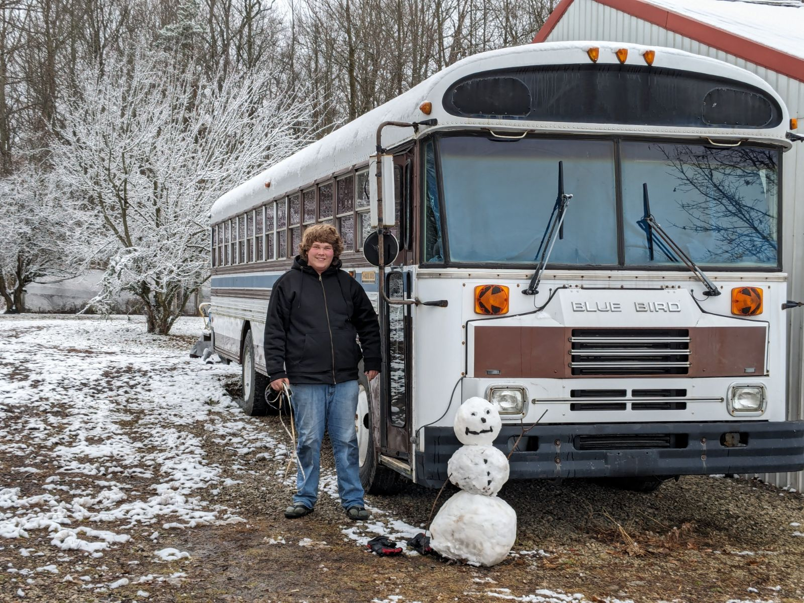
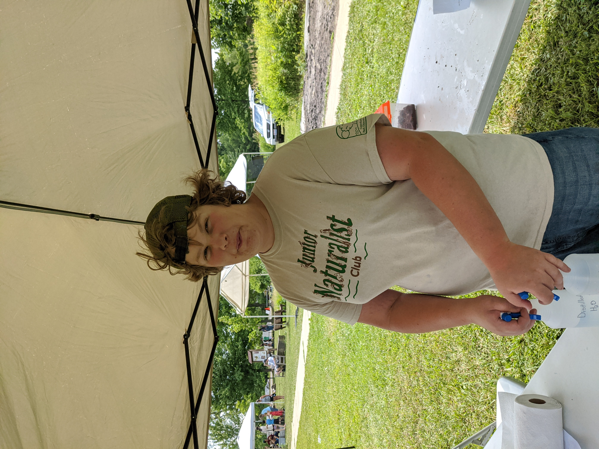
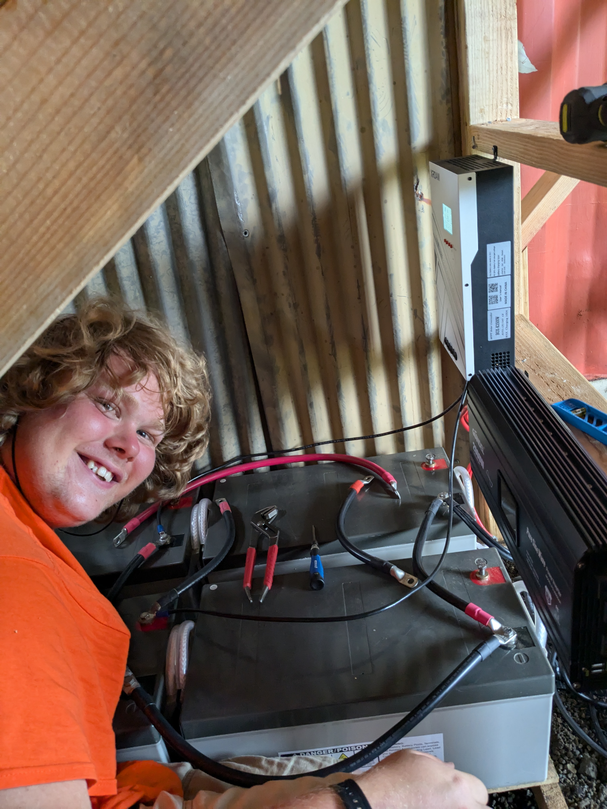
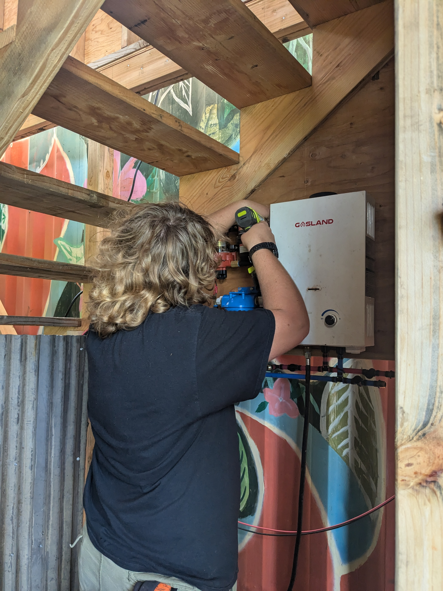
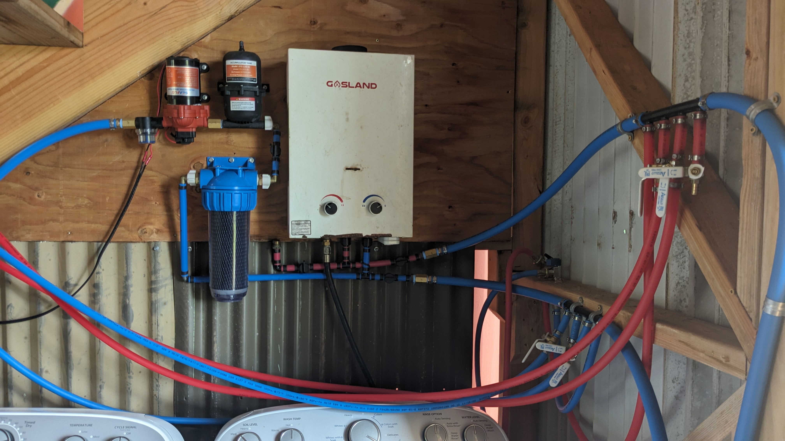
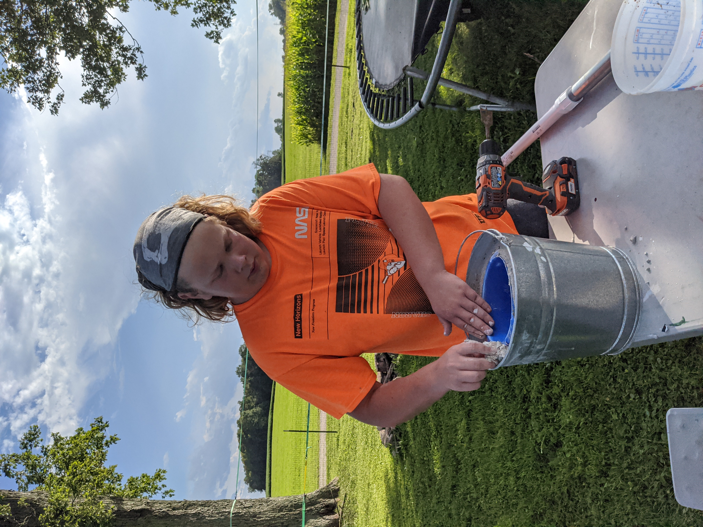
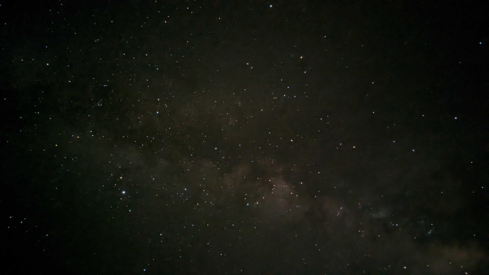
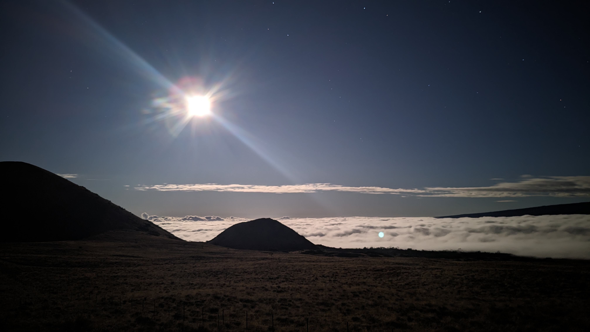
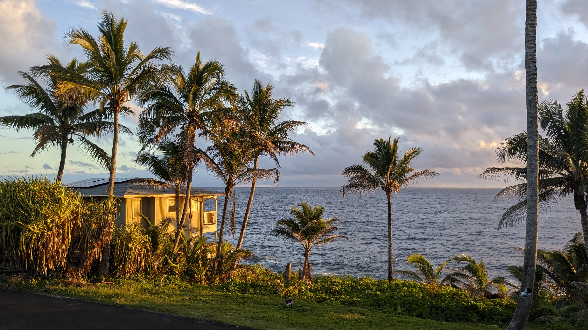

<!-- About me -->

I was born at a very young age in the middle of Ohio. I lived in a house just outside of a small town with my younger sister and was homeschooled by my mother and father.  My mother took me on walks in a nearby woods where I gained a deep appreciation of nature, and my father taught me how to properly operate and maintain the riding lawn mower. I was also taught the basics of money and capitalism, and my parents helped me start a lemonade stand at a nearby farmer's market. We lived there for around a decade, then we moved to a larger house in the same general area. My younger brother was born, and I learned early on to be responsible for him. A elder neighbor taught me how to trap and I got my first hunter's license and fur taker permit. I volunteered at several communtity events at the local fire station, and helped the elderly with yard work. Around a year later, I joined a Junior Naturalist club at the local park district. I learned many new skills, such as public presentation and animal handling and met many new people. I got my first job working at a trap shooting range, where I would reload the traps with clay pigeons and keep score. After saving nearly all of my money from the lemonade stand, I purchased a 40 foot long school bus to convert into a mobile home. As long as I can remember, I wanted to take a bus on the road and explore the world. I then got a second job working at a game bird hatchery. I would walk large pheasant pens and collect eggs to wash and hatch them.

## Me with my school bus. Yes, I own a bus!
After I graduate I will convert this bus into a mobile home and explore america!/

## Volunteering at the Junior Naturalist Club

## Assembling a small solar power system

## Plumbing a new water system for a tiny home

## Removing rust off a steel plate with a grinder

## Building a forge and attempting to forge steel

The forge became so bright that it made my camera do weird things.

### Photography Examples (More on the way!)

>Do not use/copy any of my photos on this site.

**Navigate back to [Main Site](https://jml-sites.github.io/service/)?**
